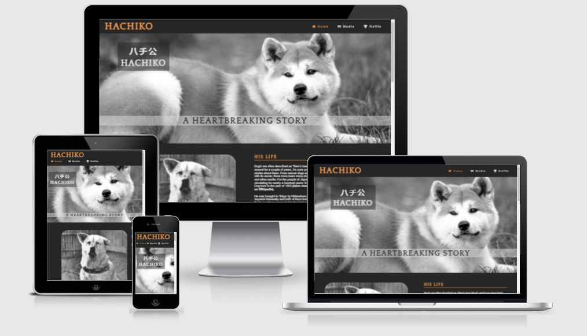
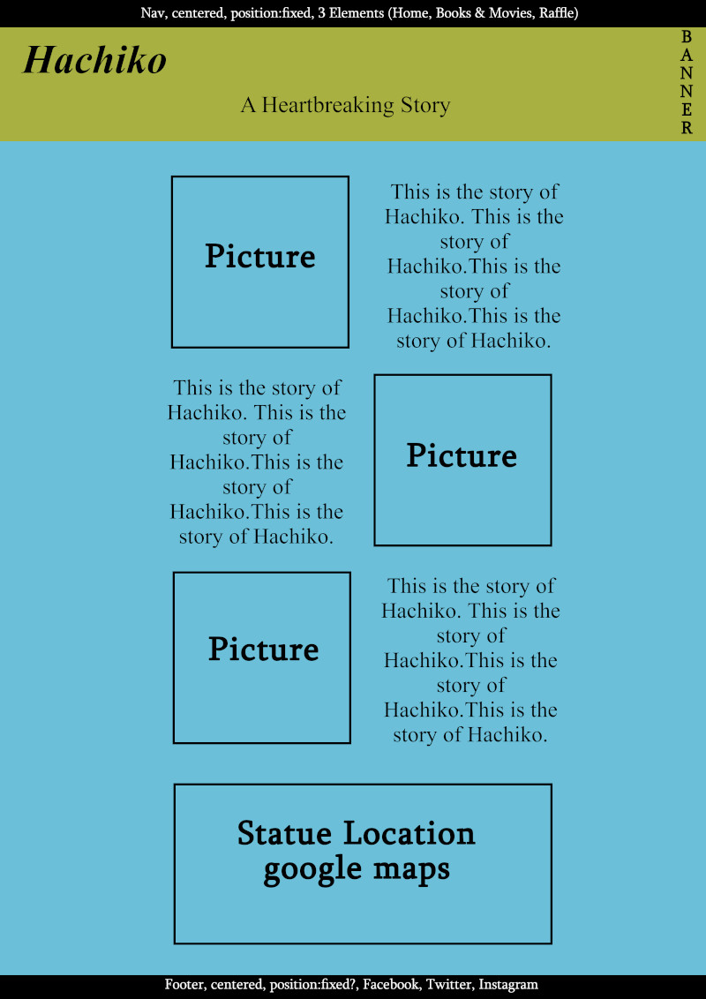
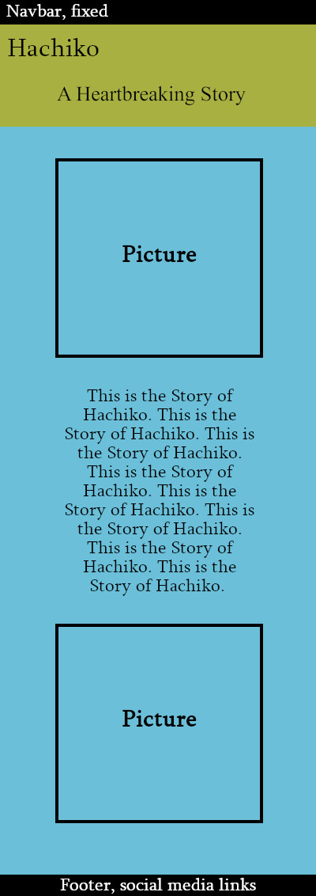
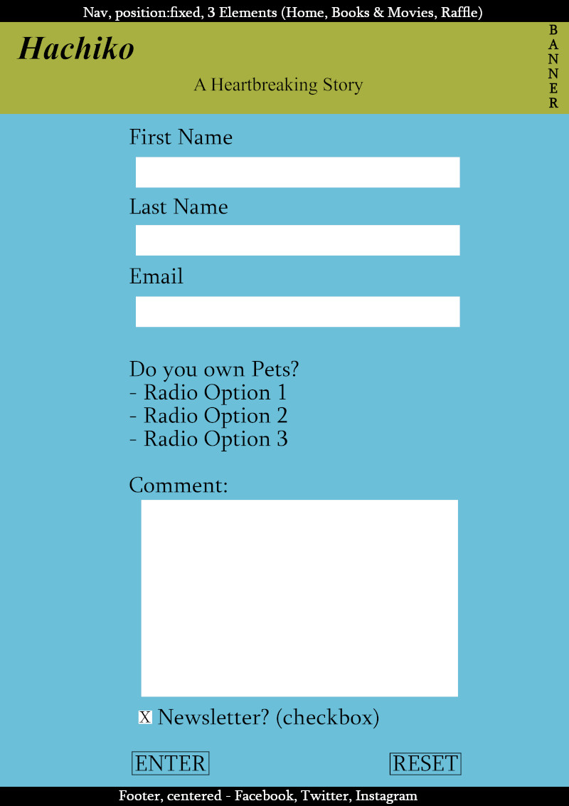
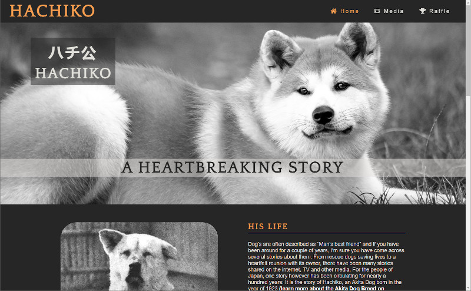
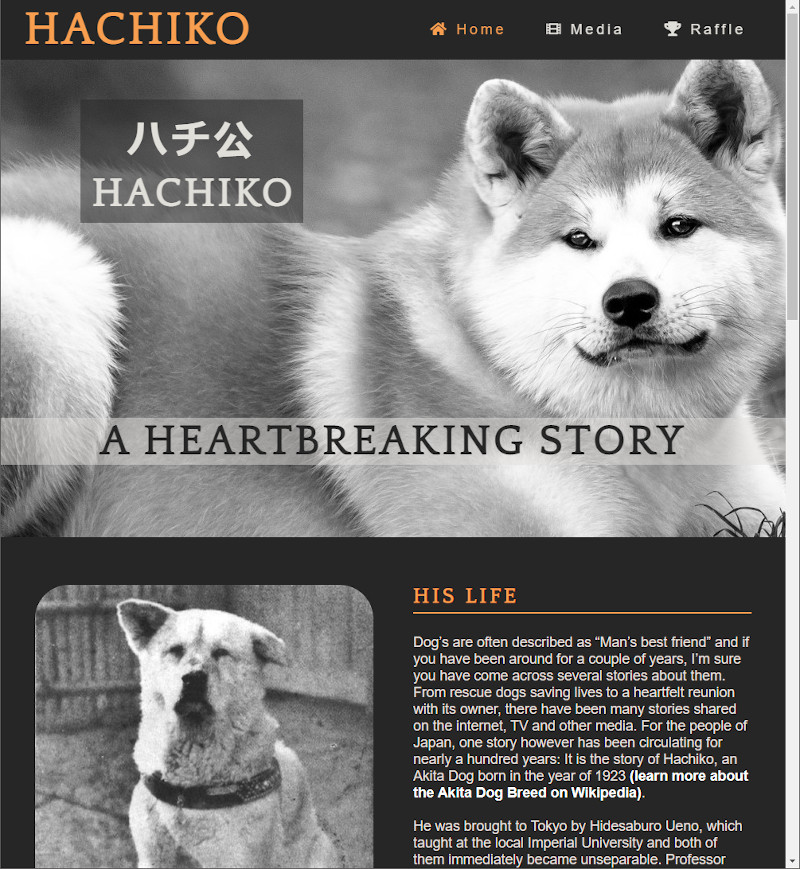
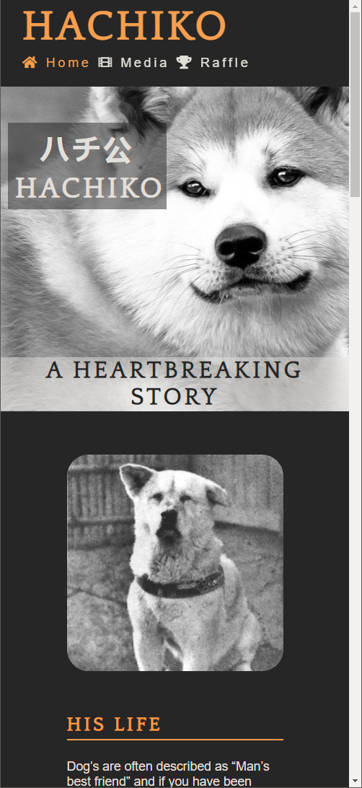
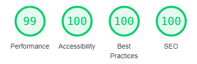
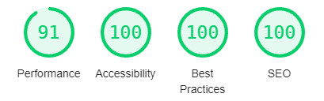
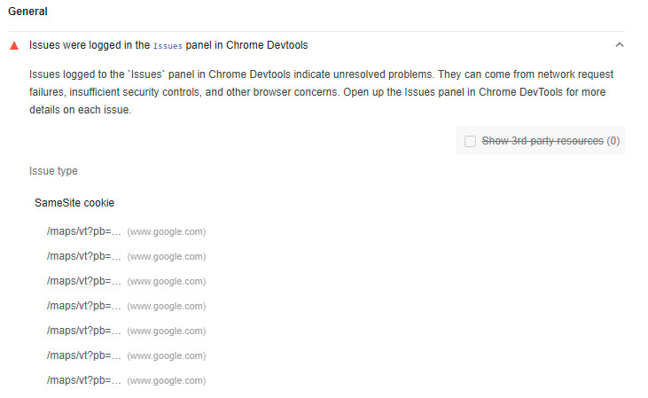

<h1 align="center"><a name="top">The Story of Hachiko Website</a></h1>

[View the live project here.](https://mycrosys.github.io/Hachiko/)

This is an informational website about the story of a Japanese Dog around the 1920s and 1930s. It is designed to be responsive on Desktop and mobile devices and easy to navigate both for first-time as well as returning visitors. The main target audience are Animal/Dog/Pet Lovers. The site is designed to be family friendly and the more gruesome details (e.g. Hachiko's autopsy) have been omitted, while the important details of the overall story are preserved.

<h2 align="center"></h2>

## User Experience (UX)

*   ### Five Planes of UXD
    -   #### Strategy Plane
    
        1. The Strategy for this Site is mostly a Personal, mainly to pass the Portfolio 1 Project. I want to do this by creating an Informational Site about the Story of Hachiko, which should target Dog Lovers and families with Dog's and other Pets.
        2. For that reason I checked other Page's that tell the story, mainly [Wikipedia](https://en.wikipedia.org/wiki/Hachik%C5%8D) and [Nerd Nomads](https://nerdnomads.com/hachiko_the_dog), both being very early google search hits. While Wikipedia is mostly an informational Internet Lexicon, Nerd Nomads is a Travel Blog. Both do have more content than shown on this site, but lack focus. Neither of them has the same target audience (Wikipedia is more for the Information, Nerd Nomads are more about traveling). In addition, both sites have too much content stacked together instead of focusing more on key aspects of both Hachiko's Story and/or the Books and Movies around him.

    -   #### Scope Plane

        1. The Scope will cover the basic Story of Hachiko and the Location of his Statue near Shibuya station where he waited for his owner. 
        2. The Site will also contain advice for family friendly media, mainly the two movies and 2 Books for younger children, if families want to introduce their children to Hachiko's story.
        3. Travel advice is out of Scope. However, as mentioned above, the google maps location of Hachiko's Statue is included, because it is a  major part of the overall story and one of the reasons why it is still being told today. I therefore consider it part of the Story and Information.

    -   #### Structure Plane

        1. The Structure of the Site should be simple. I decided for a linear structure, each content type having their separate Page, easily navigatable through the top navigation. Each Page can be reached from each location, because the Navigation Bar is always the same, always on top on each page, so there is no confusion how to reach the sub-pages.
        2. There are 3 Pages in total. A big index page with the most relevant information, a media page for different ways of consuming the story, and a page to enter a raffle and subscribe to the newsletter.
    
    -   #### Skeleton Plane

        1. The [Wireframes](#wireframes) can be found further down in this Document.
        2. The Page is presented with an image or video on one side and an explaining text next to it.
        3. The side this is implemented switches with each new content, meaning you have a picture on the left and explaining text on the right, the next content will show the picture (or movie) on the right and the text on the left.
        4. On mobile devices this changes to media content (image or movie) first, then the text below, then media content again, then text again to not confuse the visitor.

    -   #### Surface Plane

        1. The Webpage uses rounded corners for all images and the google map.
        2. Fontawesome was used for both the navigation and footer links. Comparable Icons are used on other sites so this should feel familiar to the visitor.
        3. Further Details like Font/Color choice, etc. can be found in the next separate Section: [Design](#design).

 

*   ### <a name="design">Design</a>
    -   #### Colour Scheme
        -   The three main colors used are a dark greyish (#262626), a variation of white (#e2dfda) and an orange tone (#f89e4f). The grey and white are used to fit in with the black and white pictures, while the orange represents a color tone that can be seen in the modern day Akita dog breed and is used to highlight certain elements like links and headers.
    -   #### Typography
        -   The Quattrocento-Sans font is used as the main font for the whole website with Helvetica, Arial and  sans-serif as fallback fonts in case the font doesn't import correctly. It is a very easy to read font and does fit the site well, not taking away from the overall design or the image/movie elements.
        -   To complement this, Quattrocento is used as a main header font. Because it is from the same family, it pairs exceptionally well with Quattrocento-Sans. Its backup fonts are Garamond and Times New Roman.
    -   #### Imagery
        -   The site contains a large background hero image (reduced on smaller devices) to immediately capture the attention of the visitor. It contains two cover text, one repeating the name Hachiko with the Japanese writing over it and one with the subtitle "A Heartbreaking Story". It should be obvious to everyone, what the site is all about, with many people even taking the hint that it is a Japanese, or at least Asian based stories.
        -   The website features a couple of additional pictures. The Story Page contains mostly historical pictures from the time period the story took place and the Media Page contains some book covers that feature drawn Akita dogs. All Pictures have the alt attribute to maximize accessibility.
    -   #### Videos
        -   The site has 2 movies on the media page, one for each of the 2 movies that were made. They start playing once the visitor clicks on them and if they want to, they can go to the webpage they are hosted on (YouTube). Neither video does anything until it is clicked, just showing its basic thumbnail until the visitor interacts with it.
    -   #### Google Maps
        -   The Story Page has a Google Maps location implemented, where the Statue of Hachiko can be visited. It is styled to not have color (like the pictures on the main site), for consistent design.

 

*   ### User stories

    -   #### First Time Visitor Goals

        1. As a First Time Visitor, I want to easily understand the main purpose of the site and learn more about the story of Hachiko.
        2. As a First Time Visitor, I want to be able to easily navigate throughout the site to find content.

    -   #### Returning Visitor Goals

        1. As a Returning Visitor, I want to find out if there is new information that has come out about the story.
        2. As a Returning Visitor, I want to find out if there have been new media, e.g. books, movies either about Hachiko, or comparable pet stories that I may share with my family members.

 

*   ### <a name="wireframes">Wireframes</a>
    -   Home Page Wireframe
        <h2></h2> 
    -   Mobile Wireframe
        <h2></h2> 
    -   Raffle Page Wireframe
        <h2></h2> 

 

## Features

###   Responsive on all device sizes

- The Page adjusts itself to 6 different sizes devices over 2600px wide (4k and Ultrawide Screens), 2600px to 1250px wide (most common Desktop/Laptop Display Resolutions), 1250px to 950px (to target tablet wide resolutions), 950px to 650px (bigger mobile resolutions), 650px-360px (most mobile resolutions) and 360px to around 280px (for very small resolution mobiles).
- For a view of the Page on different devices, the Picture at the [Top](#top) of the Page has a good overview. The following are 3 example resolution screenshot, emulating different sizes on google chrome / windows 10.
    1.  Desktop Resolution
            <h2></h2> 
    2.  Tablet Resolution
            <h2></h2> 
    3.  Phone Resolution
            <h2></h2> 

###   Interactive elements
- YouTube Movie Trailers: Only start playing when the visitor clicks them. The Visitor can then play them in the smaller window, Fullscreen them or go to YouTube to watch it there. Furthermore, the embedded video is configured to not use any cookies the visitor may have on YouTube that may interfere with the embedded video.
- Links: Textlinks either lead to [Wikipedia](https://www.wikipedia.org/), [IMDB](https://www.imdb.com/) or have an image Link with "Available at Amazon" to their respective product page on Amazon.co.uk for buying the product. Every Link has the rel="noopener" attribute for security reasons. None of the Amazon links are affiliate links. This is a fast and easy way for the visitor to buy the product.
- Raffle:
    1. The First Name, Last Name, Email Field and "Do you own Pets" Radio Buttons are required fields. If the Visitor does not enter data into one, the Enter Button to Submit the Form will not work and the Visitor will be informed that required data is missing.
    2. The Email Field only accepts emails with an @ in it. This and the previous point will prevent submitting forms with missing information.
    3. The Newsletter Checkbox is checked by default to always sign up the visitor unless he unchecks it.
    4. Pushing the Reset Button will reset the whole form to its standard values. All Text fields will be empty, no radio button selected and the Newsletter checkbox will be checked. This is a fast way for a visitor to clear all Inputs.
    5. Both the Enter and Reset Buttons will switch background and text color when the visitor hovers over them, giving feedback that they can press the button with a mouse click.
                <h2></h2> 

## Technologies Used

### Languages Used

-   [HTML5](https://en.wikipedia.org/wiki/HTML5)
-   [CSS3](https://en.wikipedia.org/wiki/Cascading_Style_Sheets)

### Frameworks, Libraries & Programs Used

1. [Google Fonts:](https://fonts.google.com/)
    - Google fonts were used to import the 'Titillium Web' font into the style.css file which is used on all pages throughout the project.
1. [Font Awesome:](https://fontawesome.com/)
    - Font Awesome was used on all pages throughout the website to add icons for aesthetic and UX purposes.
1. [Git](https://git-scm.com/)
    - Git was used for version control by utilizing the Gitpod terminal to commit to Git and Push to GitHub.
1. [GitHub:](https://github.com/)
    - GitHub is used to store the project's code after being pushed from Git.
1. [Gimp:](https://www.gimp.org/)
    - Gimp was used to create, modify and resize all images on this website. It was also used to create the wireframes.

 

## Testing

The W3C Markup Validator and W3C CSS Validator Services were used to validate every page of the project to ensure there were no syntax errors in the project.

-   [W3C Markup Validator](https://validator.w3.org/#validate_by_input) - [Results](https://validator.w3.org/nu/?doc=https%3A%2F%2Fmycrosys.github.io%2FHachiko%2Findex.html)
-   [W3C CSS Validator](https://jigsaw.w3.org/css-validator/#validate_by_input) - [Results](https://jigsaw.w3.org/css-validator/validator?uri=https%3A%2F%2Fmycrosys.github.io%2FHachiko%2Fassets%2Fcss%2Fstyle.css&profile=css3svg&usermedium=all&warning=1&vextwarning=&lang=de)

 

Google Lighthouse was used to test Performance, Best Practices, Accessibility and SEO on both Desktop and Mobile devices.

- Desktop Results:
  <h2></h2>
- Mobile Results:
  <h2></h2>

- On the live version of the website, there is an Issue recorded in Lighthouse relating to SameSite Cookies, lowering the "Best Practices" Score. This is probably related to the Server Configuration of Github Pages and cannot be fixed client side.
  <h2></h2>

- As for Performance, Google Lighthouse advised to use WEBP instead of JPG. Due to compatibility issues, (Safari on MacOS does not support WEBP) I have opted to keep using JPG instead of WEBP. The Performance difference is minimal and I want to maximize compatibility.

 

- Contrast and WCAG: The [Contrast Checker on WebAIM](https://webaim.org/resources/contrastchecker/) was used to check for WCAG AAA to maximize Accessibility.

    1. Text Color on the site Background: [Results](https://webaim.org/resources/contrastchecker/?fcolor=E2DFDA&bcolor=262626)
    2. Heading Color on the site Background: [Results](https://webaim.org/resources/contrastchecker/?fcolor=F89E4F&bcolor=262626)
    3. Input Text Color in Raffle Form to white Background: [Results](https://webaim.org/resources/contrastchecker/?fcolor=262626&bcolor=FFFFFF)

- Resolution and Scaling were tested with Google Dev tools down to the lowest width device (Galaxy Fold, 280px) to ensure the website works flawlessly on all resolutions 280px and above.

- The Raffle Page was tested with empty required First/Last Name and/or Email fields, entering no Email in the Email field, not selecting any radio option, with and without comments and checked and unchecked checkbox. The Form always returned the correct information. The Reset Button also worked as intended, resetting the form to its predefined state.

 

### Testing User Stories from User Experience (UX) Section

-   #### First Time Visitor Goals

    1. As a First Time Visitor, I want to easily understand the main purpose of the site and learn more about the story of Hachiko.

        1. Upon entering the site, users are automatically greeted with a clean and easily readable navigation bar to go to the page of their choice. Underneath there is a Hero Image with Hachiko's name in Japanese as well as the Headline "A Heartbreaking Story", which should lead to the conclusion that there is a Japanese or at least an Asian based story about a dog coming up.
        2. The user has two several options. Scroll down to learn more about the general story, look up other media resources about it or take part in a raffle to win something (this raffle is not real, it is just there to show my competency with HTML and CSS).

    2. As a First Time Visitor, I want to be able to easily navigate throughout the site to find content.

        1. The site has been designed so each page can stand on its own and the visitor can freely choose to switch between each of them at any time. The Navigation points were named fittingly, so the visitor always knows what to expect on that site.
        2. The Navigation is fixed at the top and scrolls with the page. It is semi transparent to not obscure the top content fully, yet is read- and useable at any time.

-   #### Returning Visitor Goals

    1. As a Returning Visitor, I want to find out if there is new information that has come out about the story.

        1. The story is almost 100 years old and has been told, yet in the past 10 years, new pictures have come out that are featured on the main page. If there are any updates due to modern technology or lost pictures being found, people can expect an additional paragraph being generated on the main page.

    2. As a Returning Visitor, I want to find out if there have been new media, e.g. books, movies either about Hachiko, or comparable pet stories that I may share with my family members.

        1. The same holds true for media content, e.g. pictures and books. While there may not be a new movie about the Story of Hachiko for a while, similar dog and other pet stories, movies and books might show up in the coming years. Pet Lovers might be interested in getting to know which movies and books there are and introduce their children to it.

 

### Further Testing

-   The Website was tested on Google Chrome, Internet Explorer, Microsoft Edge, Firefox, Opera GX and Safari browsers.
-   The website was viewed on a variety of devices such as Desktop, Laptop, iPad and different Android and iOS Phones.
-   Testing was done to ensure that all pages were linking correctly.
-   Friends were asked to review the site to point out any bugs and/or user experience issues.

 

### Known Bugs

-   On Desktop Devices with a very high resolution (above 2600px wide, e.g. a full screen window on a 4k or Ultra Wide Display), the Hero Image is no longer covering 100%. The page is then capped at 2600px and centered in the middle of the window.
-   On Desktop Devices with a very low resolution (below 280px wide), the consistency of the website can no longer be upheld. These kind of devices shouldn't be supported by modern operating systems anymore and should be extremely rare.

 

## Deployment

### GitHub Pages

The project was deployed to GitHub Pages using the following steps...

1. Log in to GitHub and locate the [GitHub Repository](https://github.com/Mycrosys/Hachiko)
2. At the top of the Repository (not top of page), locate the "Settings" Button on the menu.
3. Scroll down the Settings page until you locate the "GitHub Pages" Section.
4. Under "Source", click the dropdown called "None" and select "Main Branch".
5. The page will automatically refresh.
6. Scroll back down through the page to locate the now published site [link](https://mycrosys.github.io/Hachiko/) in the "GitHub Pages" section.

### Forking the GitHub Repository

By forking the GitHub Repository we make a copy of the original repository on our GitHub account to view and/or make changes without affecting the original repository by using the following steps...

1. Log in to GitHub and locate the [GitHub Repository](https://github.com/Mycrosys/Hachiko)
2. At the top of the Repository (not top of page) just above the "Settings" Button on the menu, locate the "Fork" Button.
3. You should now have a copy of the original repository in your GitHub account.

### Making a Local Clone

1. Log in to GitHub and locate the [GitHub Repository](https://github.com/Mycrosys/Hachiko)
2. Under the repository name, click "Clone or download".
3. To clone the repository using HTTPS, under "Clone with HTTPS", copy the link.
4. Open Git Bash
5. Change the current working directory to the location where you want the cloned directory to be made.
6. Type `git clone`, and then paste the URL you copied in Step 3.
7. Press Enter. Your local clone will be created.

Click [Here](https://help.github.com/en/github/creating-cloning-and-archiving-repositories/cloning-a-repository#cloning-a-repository-to-github-desktop) to retrieve pictures for some of the buttons and more detailed explanations of the above process.

 

## Credits

### Code

-   The full-screen hero image code came originally from the [Love Running Project at Code Institute](https://github.com/Code-Institute-Solutions/love-running-2.0-sourcecode). The same goes for the keyframe animation as well as the footer code. However, none of these 3 remaining in its original form because they have been modified and styled differently in several aspects to fit the sites need.

### Content

-   All content was written by the developer, except for the Descriptions of the Books on media.html, written in quotes and italicized. These are from the descriptions of mentioned books and the intellectual property of their respective owners.

-   The pairings of the colors and fonts comes from [this Blog post](https://www.pagecloud.com/blog/best-google-fonts-pairings).

### Images and Media

- The Akita Hero Image comes from [maxxxiss](https://pixabay.com/users/maxxxiss-19205165/?utm_source=link-attribution&amp;utm_medium=referral&amp;utm_campaign=image&amp;utm_content=5763408) from [Pixabay](https://pixabay.com/?utm_source=link-attribution&amp;utm_medium=referral&amp;utm_campaign=image&amp;utm_content=5763408).

- The Dog Favicon next to the Websites Name in the Tab comes from the [Iphone Icons Icon Pack from findicons.com](https://findicons.com/pack/2579/iphone_icons) and was designed by [Iconshock](https://www.iconshock.com/).

- Hachiko's Portrait on index.html comes from an Unknown Author from [Wikipedia](https://en.wikipedia.org/wiki/Hachik%C5%8D#/media/File:Hachiko.JPG).

- Hachiko Waiting Image on index.html was taken by Isamu Yamamoto. It was discovered after 80 years when his family was cleaning the house and then given to the sculptur of the second statue, Takeshi Ando, who shared it with the world. The image was taken from the [Moviepaws](https://moviepaws.com/2015/11/12/rare-photo-of-legendarily-loyal-japanese-dog-hachiko/) website.

- One year anniversary of Hachiko's death picture on index.html comes from an Unknown Author from "Showa Day by Day" volume 4, Kodansha Co., 1989. The Image was taken from [Wikipedia](https://en.wikipedia.org/wiki/Hachik%C5%8D#/media/File:One_anniversary_of_Hachiko_19360308_Scan10038.JPG).

- The Cover Image of "Hachiko Waits" by Lesléa Newman comes from [Amazon](https://www.amazon.co.uk/Hachiko-Waits-Leslea-Newman/dp/0312558066/ref=sr_1_1?keywords=hachiko+waits&qid=1636647742&qsid=257-5039210-9072519&sr=8-1&sres=0312558066%2CB016Q2E9HU%2C1545527962%2CB01FKTE5TW%2CB015X4Q21I%2C1974494845%2CB08HTKBRKT%2CB07Y5GZ8ZZ%2CB0899FY9XP%2CB001TO5G6E%2CB08HTVRZK2%2CB08HTDVKD6%2CB084XQZYVT%2CB08HTDC8XM%2CB01M0HSLCT%2CB004EAIY3M) and the copyright is believed to belong to its publisher [Square Fish Books](https://us.macmillan.com/publishers/square-fish-books/).

- The Cover Image of "Hachiko: The True Story of a loyal Dog" by Pamela S. Turner comes from [Amazon](https://www.amazon.co.uk/Hachiko-True-Story-Loyal-Dog/dp/0547237553/ref=sr_1_2?keywords=hachiko&qid=1636647758&qsid=257-5039210-9072519&sr=8-2&sres=B08WV8HYY2%2C0547237553%2CB00005G2DH%2C0312558066%2CB08HTVRZK2%2CB01B3A1BNU%2CB08HTKBRKT%2CB015QN628E%2C190686196X%2CB07Q57TR85%2C1973380137%2CB00H36AK2W%2CB07VLGD3R2%2CB071RN7MPQ%2CB01CRM9S74%2CB07WYZZXKL&srpt=DOWNLOADABLE_MOVIE) and the illustration of it was done by Yan Nascimbene.

- The "Available on Amazon" Image comes from [Pngkey.com](https://www.pngkey.com/detail/u2q8w7w7q8r5u2a9_cappuccino-now-available-on-amazon-co-uk/). The Amazon Logo is copyrighted by the [Amazon Company](https://www.aboutamazon.com/).

- The Movie Trailer of "Hachiko Monogatari" comes from the [HD Retro Trailers Channel on YouTube](https://www.youtube.com/channel/UC3cs9UJtR6GXwoGcMHhSFYA). Copyright belongs to the [Shochiku Company](https://www.shochiku.co.jp/global/).

- The Movie Trailer of "Hachi - A Dog's Tale" comes from the [Official Sony Pictures Home Entertainment YouTube Channel](https://www.youtube.com/channel/UCfWMxyvASxrO_j_HcMwBZ-A). Copyright belongs to [Sony Pictures Home Entertainment](https://www.sonypictures.com/).

### Readme

-   The Basic Structure of the Readme was taken from [Code Institute's Sample Readme](https://github.com/Code-Institute-Solutions/SampleREADME/blob/master/README.md).

### Acknowledgements

-   My Mentor for continuous helpful feedback.

-   My Peers in Code Institute's Slack channel for their feedback.