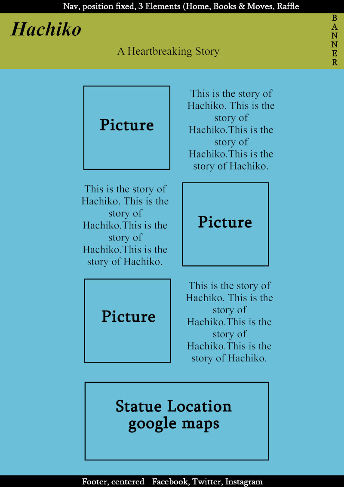

<h1 align="center">The Story of Hachiko Website</h1>

[View the live project here.](https://mycrosys.github.io/Hachiko/)

This is an informational website about the story of a Japanese Dog around the 1920s and 1930s. It is designed to be responsive on Desktop and mobile devices and easy to navigate both for first-time as well as returning visitors. The main target audience are Animal/Dog/Pet Lovers. The site is designed to be family friendly and the more gruesome details (e.g. Hachiko's autopsy) have been omitted, while the important details of the overall story are preserved.

<h2 align="center"></h2>

## User Experience (UX)

-   ### User stories

    -   #### First Time Visitor Goals

        1. As a First Time Visitor, I want to easily understand the main purpose of the site and learn more about the story of Hachiko.
        2. As a First Time Visitor, I want to be able to easily navigate throughout the site to find content.

    -   #### Returning Visitor Goals

        1. As a Returning Visitor, I want to find out if there is new information that has come out about the story.
        2. As a Returning Visitor, I want to find out if there have been new media, e.g. books, movies either about Hachiko, or comparable pet stories that I may share with my family members.

-   ### Design
    -   #### Colour Scheme
        -   The three main colors used are a dark greyish (#262626), a variation of white (#e2dfda) and an orange tone (#f89e4f). The grey and white are used to fit in with the black and white pictures, while the orange represents a color tone that can be seen in the modern day Akita dog breed and is used to highlight certain elements like links and headers.
    -   #### Typography
        -   The Quattrocento-Sans font is used as the main font for the whole website with Helvetica, Arial and  sans-serif as fallback fonts in case the font doesn't import correctly. It is a very easy to read font and does fit the site well, not taking away from the overall design or the image/movie elements.
        -   To complement this, Quattrocento is used as a main header font. Because it is from the same family, it pairs exceptionally well with Quattrocento-Sans. Its backup fonts are Garamond and Times New Roman.
    -   #### Imagery
        -   The site contains a large background hero image (reduced on smaller devices) to immediately capture the attention of the visitor. It contains two cover text, one repeating the name Hachiko with the Japanese writing over it and one with the subtitle "A Heartbreaking Story". It should be obvious to everyone, what the site is all about, with many people even taking the hint that it is a Japanese, or at least Asian based stories.
        -   The website features a couple of additional pictures. The Story Page contains mostly historical pictures from the time period the story took place and the Media Page contains some book covers that feature drawn Akita dogs.
    -   #### Videos
        -   The site has 2 movies on the media page, one for each of the 2 movies that were made. They start playing once the user clicks on them and if they want to, they can go to the webpage they are hosted on (YouTube). Neither video does anything until it is clicked, just showing its basic thumbnail until the visitor interacts with it.
    -   #### Google Maps
        -   The Story Page has a Google Maps location implemented, where the Statue of Hachiko can be visited. It is styled to not have color (like the pictures on the main site), for consistent design.

*   ### Wireframes

    -   Home Page Wireframe
        <h2></h2>
    -   Mobile Wireframe
        <h2></h2>
    -   Raffle Page Wireframe
        <h2></h2>

## Features

-   Responsive on all device sizes

-   Interactive elements (Raffle Page)

## Technologies Used

### Languages Used

-   [HTML5](https://en.wikipedia.org/wiki/HTML5)
-   [CSS3](https://en.wikipedia.org/wiki/Cascading_Style_Sheets)

### Frameworks, Libraries & Programs Used

1. [Google Fonts:](https://fonts.google.com/)
    - Google fonts were used to import the 'Titillium Web' font into the style.css file which is used on all pages throughout the project.
1. [Font Awesome:](https://fontawesome.com/)
    - Font Awesome was used on all pages throughout the website to add icons for aesthetic and UX purposes.
1. [Git](https://git-scm.com/)
    - Git was used for version control by utilizing the Gitpod terminal to commit to Git and Push to GitHub.
1. [GitHub:](https://github.com/)
    - GitHub is used to store the projects code after being pushed from Git.
1. [Gimp:](https://www.gimp.org/)
    - Gimp was used to create, modify and resize all images on this website. It was also used to create the wireframes.

## Testing

The W3C Markup Validator and W3C CSS Validator Services were used to validate every page of the project to ensure there were no syntax errors in the project.

-   [W3C Markup Validator](https://jigsaw.w3.org/css-validator/#validate_by_input)
-   [W3C CSS Validator](https://jigsaw.w3.org/css-validator/#validate_by_input)

Google Lighthouse was used to test Performance, Best Practices, Accessibility and SEO on both Desktop and Mobile devices.

- Desktop Results:
  <h2></h2>
- Mobile Results:
  <h2></h2>

### Testing User Stories from User Experience (UX) Section

-   #### First Time Visitor Goals

    1. As a First Time Visitor, I want to easily understand the main purpose of the site and learn more about the story of Hachiko.

        1. Upon entering the site, users are automatically greeted with a clean and easily readable navigation bar to go to the page of their choice. Underneath there is a Hero Image with Hachiko's name in Japanese as well as the Headline "A Heartbreaking Story", which should lead to the conclusion that there is a Japanese or at least asian based story about a dog coming up.
        2. The user has two several options. Scroll down to learn more about the general story, look up other media ressources about it or take part in a raffle to win something (this raffle is not real, it is just there to show my competency with html and css).

    2. As a First Time Visitor, I want to be able to easily navigate throughout the site to find content.

        1. The site has been designed so each page can stand on its own and the user can freely chose to switch between each of them at any time. The Navigation points are named fittingly, so the visitor always knows what to expect on that site.
        2. The Navigation is fixed at the top and scrolls with the page. It is semi transparent to not obscure the top content fully, yet is read- and useable at any time-

-   #### Returning Visitor Goals

    1. As a Returning Visitor, I want to find out if there is new information that has come out about the story.

        1. The story is almost 100 years old and has been told, yet in the past 10 years, new pictures have come out that are featured on the main page. If there are any updates due to modern technology or lost pictures being found, people can expect an additional paragraph being generated on the main page.

    2. As a Returning Visitor, I want to find out if there have been new media, e.g. books, movies either about Hachiko, or comparable pet stories that I may share with my family members.

        1. The same holds true for media content, e.g. pictures and books. While there may not be a new movie about the Story of Hachiko for a while, similar dog and other pet stories, movies and books might show up in the coming years. Pet Lovers might be interested in getting to know which movies and books there are and introduce their children to it.

### Further Testing

-   The Website was tested on Google Chrome, Internet Explorer, Microsoft Edge, Firefox, Opera GX and Safari browsers.
-   The website was viewed on a variety of devices such as Desktop, Laptop, iPad and different Android and iOS Phones.
-   Testing was done to ensure that all pages were linking correctly.
-   Friends were asked to review the site to point out any bugs and/or user experience issues.

### Known Bugs

-   On Desktop Devices with a very high resolution (above 2600px wide, e.g. a full screen window on a 4k Display), the Hero Image does no longer cover 100% of the width and the cover text falls outside of it.
-   On Desktop Devices with a very low resolution (below 260px wide), the consistency of the website can no longer be upheld. These kind of devices shouldn't be supported by modern operating systems anymore and should be extremely rare.

## Deployment

### GitHub Pages

The project was deployed to GitHub Pages using the following steps...

1. Log in to GitHub and locate the [GitHub Repository](https://github.com/Mycrosys/Hachiko)
2. At the top of the Repository (not top of page), locate the "Settings" Button on the menu.
3. Scroll down the Settings page until you locate the "GitHub Pages" Section.
4. Under "Source", click the dropdown called "None" and select "Main Branch".
5. The page will automatically refresh.
6. Scroll back down through the page to locate the now published site [link](https://mycrosys.github.io/Hachiko/) in the "GitHub Pages" section.

### Forking the GitHub Repository

By forking the GitHub Repository we make a copy of the original repository on our GitHub account to view and/or make changes without affecting the original repository by using the following steps...

1. Log in to GitHub and locate the [GitHub Repository](https://github.com/Mycrosys/Hachiko)
2. At the top of the Repository (not top of page) just above the "Settings" Button on the menu, locate the "Fork" Button.
3. You should now have a copy of the original repository in your GitHub account.

### Making a Local Clone

1. Log in to GitHub and locate the [GitHub Repository](https://github.com/Mycrosys/Hachiko)
2. Under the repository name, click "Clone or download".
3. To clone the repository using HTTPS, under "Clone with HTTPS", copy the link.
4. Open Git Bash
5. Change the current working directory to the location where you want the cloned directory to be made.
6. Type `git clone`, and then paste the URL you copied in Step 3.
7. Press Enter. Your local clone will be created.

Click [Here](https://help.github.com/en/github/creating-cloning-and-archiving-repositories/cloning-a-repository#cloning-a-repository-to-github-desktop) to retrieve pictures for some of the buttons and more detailed explanations of the above process.

## Credits

### Code

-   The full-screen hero image code came originally from the [Love Running Project at Code Institute](https://github.com/Code-Institute-Solutions/love-running-2.0-sourcecode). The same goes for the keyframe animation as well as the footer code. However, none of these 3 remain in its original form because they have been modified and styled differently in several aspects to fit the sites need.

